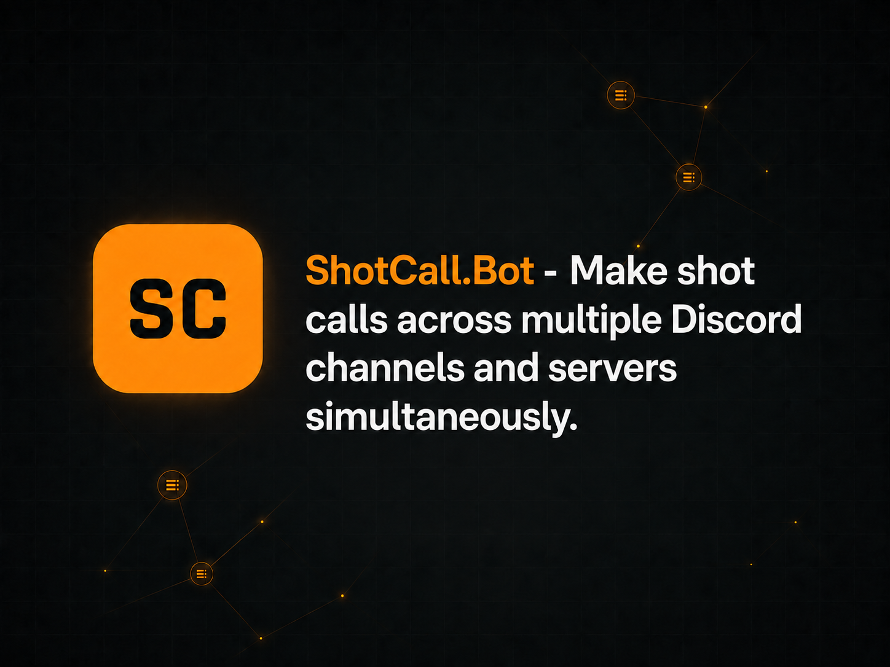

# ShotCall.bot

> Real-time cross-server voice relay and tactical coordination system for Discord guilds and gaming coalitions.

[Website](https://shotcall.bot) | [X (Twitter)](https://x.com/shotcallbot)

---

## Overview

**ShotCall.bot** is an advanced Discord voice coordination platform designed for large-scale PvP battles, guild wars, alliance raids, and multi-squad tactical operations. It allows commanders to transmit voice streams instantly across multiple channels and even across allied Discord servers.

## Features

- **Cross-Server Voice Relay:** Unite multiple Discord servers under a single command structure during coalition wars.
- **Flexible Voice Modes:** 
  - `BROADCAST`: One-way centralized announcements.
  - `FEEDBACK`: Controlled feedback channels between the host and allied teams.
  - `CONFERENCE`: Multi-commander meetings via mix-minus audio processing.
- **Multi-Channel Support:** Deploy speaker bots to broadcast audio smoothly across various voice channels.
- **Granular Permissions:** Set up dedicated roles for commanders and moderators using intuitive slash commands (`/setup`, `/start`, `/join`, `/status`).
- **Persistent State Recovery:** Automatic state restoration and database synchronization for active broadcasts.

## Commands

| Command | Description |
| :--- | :--- |
| `/setup` | Configures guild, roles, headquarters, and speaker bots. |
| `/start [mode]` | Initiates the active voice transmission stream. |
| `/join code:...` | Joins an active stream as an allied guild using a secure code. |
| `/status` | Manages and toggles active routing paths. |
| `/stop` | Terminates the voice transmission stream. |

## Supported Languages

| Language | Code | Flag / Region |
| :--- | :---: | :---: |
| English | `en` | 🇬🇧 / 🇺🇸 |
| Türkçe | `tr` | 🇹🇷 |
| Deutsch  | `de` | 🇩🇪 |
| Español  | `es` | 🇪🇸 |
| Português  | `pt` | 🇵🇹 / 🇧🇷 |
| Italiano  | `it` | 🇮🇹 |
| Français  | `fr` | 🇫🇷 |
| Русский  | `ru` | 🇷🇺 |
| Slovenščina  | `sl` | 🇸🇮 |

## Official Links

- **Official Website:** [shotcall.bot](https://shotcall.bot)
- **X (Twitter):** [@shotcallbot](https://x.com/shotcallbot)

## License

Distributed under the MIT License. See `LICENSE` for more information.
